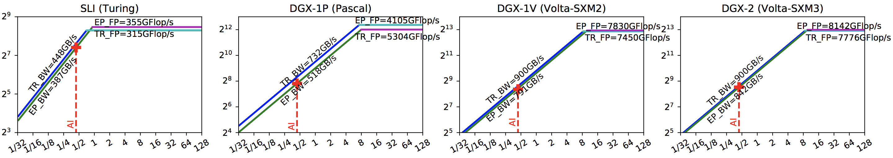
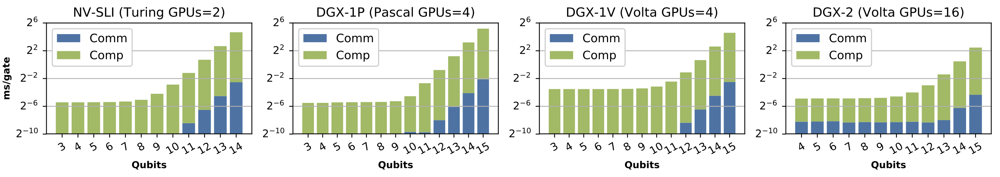
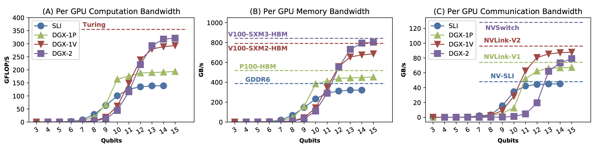
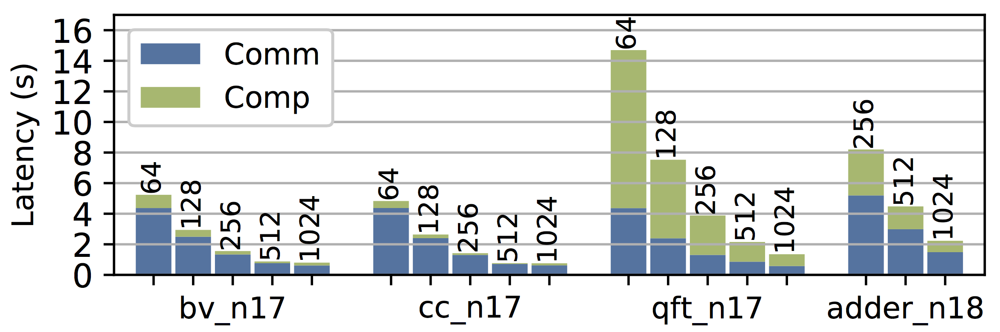

# DM_Sim: Quantum Circuit Simulator via Density Matrix on GPU Clusters

A Density Matrix Quantum Simulator for Single-GPU, Single-Node-Multi-GPUs and Multi-Nodes GPU Cluster. Please see our paper for details.


## Current version

Latest version: **1.0**

DM_Sim is still under active development. Please be patient if there's an error. We will continuously add new features. Questions and suggestions are welcome.

## About DM_Sim

In this repository you will find a CUDA implementation for simulating deep quantum circuits on a single-GPU, a single-node-multi-GPUs (e.g., NVIDIA [DGX-1](https://www.nvidia.com/en-gb/data-center/dgx-systems/dgx-1/), [DGX-2](https://www.nvidia.com/en-us/data-center/dgx-2/) and HGX)), and multi-nodes GPU cluster (like the [Summit supercomputer](https://www.olcf.ornl.gov/summit/) in ORNL) using full density matrices. Our DM_sim simulator fully supports [OpenQASM](https://github.com/Qiskit/openqasm) intermediate-representation (IR) language (see [spec](https://arxiv.org/pdf/1707.03429.pdf). OpenQASM can be generated by Qiskit, Cirq, ProjectQ and Scaffold (see below). For scale-up (i.e., single-node-multi-GPUs), we leverage fast intra-node interconnects such as NVLink, NV-SLI and NVSwitch (see our [benchmarking](https://drive.google.com/open?id=13S4zbl4asHlWv_oebHw1YOWkzDr6I9wg) paper and [evaluation](https://arxiv.org/abs/1903.04611) paper about several modern GPU Interconnect). This simulator is based on Multi-GPU-BSP (MG-BSP) model, please see our paper for details.

DM_Sim simulates 1M general gates with 15-qubits gate-by-gate in 94 minutes on DGX-2 (16 NVIDIA V100 GPUs) using density-matrix, on average 5.6 ms/gate. See our paper.

## Supported Gate

|Gates | Meaning | Gates | Meaning |
|:---: | ------- | :---: | ------- |
|U3    | 3 parameter 2 pulse 1-qubit | CY | Controlled Y |
|U2 | 2 parameter 1 pulse 1-qubit  | SWAP | Swap     |
|U1 | 1 parameter 0 pulse 1-qubit  |  CH | Controlled H   |
|CX | Controlled-NOT  |  CCX | Toffoli   |
|ID | Idle gate or identity  |  CSWAP | Fredkin |
|X | Pauli-X bit flip  | CRX | Controlled RX rotation  |
|Y | Pauli-Y bit and phase flip  | CRY | Controlled RY rotation  |
|Z | Pauli-Z phase flip  |  CRZ | Controlled RZ rotation |
|H | Hadamard  |  CU1 | Controlled phase rotation  |
|S | sqrt(Z) phase  |  CU3 | Controlled U3 |
|SDG | conjugate of sqrt(Z)  |  RXX | 2-qubit XX rotation |
|T | sqrt(S) phase  | RZZ | 2-qubit ZZ rotation   |
|TDG | conjugate of sqrt(S) | RCCX | Relative-phase CXX |
|RX | X-axis rotation | RC3X | Relative-phase 3-controlled X |
|RY | Y-axis rotation | C3X | 3-controlled X |
|RZ | Z-axis rotation | C3XSQRTX | 3-controlled sqrt(X) |
|CZ | Controlled phase | C4X | 4-controlled X |
|C1 | Arbitrary 1-qubit gate | C2 | Arbitrary 2-qubit gate |

## Package Structure
#### **src**: DM_Sim source file
 - util.cuh: Error checking, allocation and release, and validation functions.
 - gate.cuh: Gate definition.
 - dmsim_sin.cu: single-GPU DM_Sim main simulation program.
 - dmsim_omp.cu: OpenMP-based single-node-multi-GPU main simulation program.
 - dmsim_mpi.cu: MPI-based multi-nodes main simulation program.
 - configuration_sample.h: DM_Sim configurations and gate macro.
 - circuit.cuh: Circuit file. It will be auto-generated by *dmsim_qasm_ass.py* and *dmsim_gen_cir.py*
 - summit_dmsim.lsf: Sample ORNL Summit lsf file for job submission.
 - Makefile_sample: sometimes used for generating Makefile.
 - Makefile: for compilation. It will be auto-generated by *dmsim_qasm_ass.py* and *dmsim_gen_cir.py*

#### **benchmark**: 
 - OpenQASM-based benchmarks (.qasm), it contains some circuits in the paper, for more, please refer to our [QASMBench](https://github.com/uuudown/QASMBench).

#### **tool**: Supporting tools (see our paper for detail).
 - dmsim_qasm_ass.py: Convert OpenQASM file (e.g., adder.qasm) to a DM_Sim circuit file (e.g., circuit.cuh). It also reports the total number of qubits, the total number of gates and the total number of CX (CNOT) gates.
 - dmsim_gen_cir.py: Generat synthetic circuits by (1) randomly sampling from a gate set; (2) general 1-qubit circuits (purely C1 gates).
 - dmsim_run_test.py: Run tests by generating synthetic circuits. Perform qubits, gates, GPU-scaling, and very-deep tests. It calls dmsim_gen_cir.py. 
 - dmsim_run_benchmark.py: Run some benchmarks from benchmark folder. It calls dmsim_qasm_ass.py for assembling.

#### **artifact**: System configuration for the evaluation performed in our paper.
These are generated by using the SC [Author-Kit](https://github.com/SC-Tech-Program/Author-Kit) tool.
 - SLI.txt: For the SLI-system with two RTX2080 GPUs connected by NV-SLI bridge.
 - dgx-1P.txt: For the Pascal architecture P100-DGX-1 with 8 GPUs connected by NVLink-V1.
 - dgx-1V.txt: For the Volta architecture V100-DGX-1 with 8 GPUs connected by NVLink-V2.
 - dgx-2.txt: For the Volta architecture DGX-2 with 16 GPUs connected by NVSwitch.
 - Summit.txt: For the Volta architecture ORNL summit supercomputer supported GPUDirect-RDMA.

#### **img**: images for the Repo.


## Performance
DM-Sim is bounded by GPU memory access bandwidth, and possibly by interconnect bandwidth. We use [Roofline](https://en.wikipedia.org/wiki/Roofline_model) model to show the bound. The real sustainable bandwidth is profiled by using the [Roofline Toolkit](https://bitbucket.org/berkeleylab/cs-roofline-toolkit/src/master/) from LBNL. This following figure shows the Roofline model for the simulation on SLI, DGX-1P, DGX-1V and DGX-2 systems. See the files in **artifact** folder.


#### We show the performance of simulation by increasing the number of qubits (256 gates):


#### We show the performance of simulation by increasing the number of gates (14 qubits):


#### And performance bound on computation, memory access and communication:


#### Performance for deep circuits on DGX-2 using 16 GPUs and 15 qubits using general 1-qubit gate(i.e., C1 gate):

|Gates | Computation | Communication | Simulation | Time/Gate |
|:---: | :---------: | :-----------: | :--------: | :-------: |
| 10K  |     53.8s   |     9.36ms    |   53.8s    |  5.38ms   |
| 100K |     558.0s  |     7.31ms    |   558.0s   |  5.58ms   |
|  1M  |    5645.5s  |     7.21ms    |   5645.5s  |  5.65ms   |

#### Performance on ORNL Summit supercomputer, the numbers on the bars indicat the number of GPUs utilized. For benchmarks, please see [QASMBench](https://arxiv.org/abs/2005.13018). Clearly, the communication overhead is much significant than scale-up.


## Compile
Update your NVCC path, GPU architecture (e.g., SM_70 for Volta). Then the following for compilation: 
```text
make -f Makefile_sample
```

When compiling for very deep circuit, you're suggested to use multi-processing, such as:
```text
make -j 16
```

Makefile can be also generated by *dmsim_qasm_ass.py* and *dmsim_gen_cir.py*


## Execution

You need to first config the "configuration.h" file to update *N_QUBITS* to the number of qubits in the circuit, and *GPU_SCALE* to the log2 of the number of GPUs (e.g., GPU_SCALE=2 for 4 GPUs, 3 for 8 GPUs, etc.).

### Single GPU

Using the following command for execution:
```text
./dmsim_sin
```
The output include number of qubits, number of GPUs, computation time (in ms), communication time (in ms), total simulation time (in ms) and GPU memory consumption in total. 

### Scale-up
For running on single-node-multi-GPUs, as the adjoint operation requires all-to-all communication for density-matrix transpostion, we need all GPUs to be directly connected. For example, in V100-DGX-1, although there're 8 GPUs, not all of them are directly-connected by NVLink. In such a case, we can only simulate up to 4 GPUs. Please see our paper for detail.

```text
./dmsim_omp
```

### Scale-out
For running on GPU-accelerated cluster, it requires GPUDirect-RDMA for direct GPU memory access which requires specific system configuration. See *summit_dmsim.lsf* as an example for running on ORNL summit supercomputer.

```text
jsrun -n1024 -a1 -g1 -c1 --smpiargs="-gpu" ./dmsim_mpi
```

## More Configurations

To simulate qubit-size larger than 15, the index is alread larger than a noraml unsigned integer, you need to define **idxtype** as "unsiged long long" in configuration.h.

When defining "CUDA_ERROR_CHECK", DM_Sim checks CUDA API error and kernel execution error.

When defining "RAND_INIT_DM", we do random initialization for the density matrix rather than zero.

## Support Tools

#### dmsim_qasm_ass.py
To assemble an OpenQASM (e.g., adder.qasm) to a DM_Sim circuit file (e.g., circuit.cuh):

```text
python dmsim_qasm_ass.py -i adder.qasm -o circuit.cuh
```
It outputs "circuit.cuh", "Makefile", and reports the number of qubits, the number of gates, and the number of CX/CNOT gates.

You can use "-s" to select the mode: 'sin' for single-GPU, 'omp' for OpenMP scale-up, and 'mpi' for MPI scale-out):

```text
python dmsim_qasm_ass.py -i adder.qasm -o circuit.cuh -s omp
```

For deep circuit, nvcc can take long time for compilation, to accelerate this process by multi-processing, we partition deep circuits into segments for separated compilation. You can specify the threshold for this parition. Please see our paper for detail. To set the threshold as 512 gates:

```text
python dmsim_qasm_ass.py -i adder.qasm -o circuit.cuh -s omp -t 512
```

Use "-h" to see the options.

#### dmsim_gen_cir.py
Generate synthetic circuits for simulation. It randomly picks a gate from a gate-collection defined in the file, and randomly applies to a qubit or two qubits. 

Generating 256 gates on 12 qubits:

```text
python dmsim_gen_cir.py -n 12 -g 256
```

You can use "-s" to select the mode: 'sin' for single-GPU, 'omp' for OpenMP scale-up, and 'mpi' for MPI scale-out):

```text
python dmsim_gen_cir.py -n 12 -g 256 -s mpi
```

You can specify the threshold for deep-circuit simulation:
```text
python dmsim_gen_cir.py -n 12 -g 256 -s mpi -t 1024
```

In the paper, we discuss the generat gates, which is C1 for 1-qubit. We can generate purely C1-based circuit for most general simulation.
```text
python dmsim_gen_cir.py -n 12 -g 256 -s mpi -t 1024 -r 1
```

You can also specify the random seed, please see the options using "-h"


#### dmsim_run_test.py
Performing testsgenerating synthetic circuits. It calls dmsim_gen_cir.py to generate the circuits and Makefile. 

For gate-test, specify the starting gate volume and ending gate volume, each step we double the number of gates:
```text
python dmsim_run_test.py -st_ng 8 -ed_ng 1024
```

For qubit-test, specify the starting qubit number and ending qubit number, each step we add one more qubit:
```text
python dmsim_run_test.py -st_nq 4 -ed_nq 12
```

You can use "-s" to select the mode: 'sin' for single-GPU, 'omp' for OpenMP scale-up, and 'mpi' for MPI scale-out):
```text
python dmsim_run_test.py -st_nq 4 -ed_nq 12 -s omp
```


For GPU-test, define "N_GPUS" as the maximum number of GPUs, we start from 2 GPUs and each time we double the number of GPUs (this will be updated).

For deep-test, define "N_QUBITS" and "N_GPUS" inside, and update "gs" list in the file (this will be updated)


#### dmsim_run_benchmark.py
Run real quantum circuit benchmarks from "benchmark" folder. It calls dmsim_qasm_ass.py to convert, and then compile and run the circuit. 

You need to input the benchmark information into the file. Please see the comments in the source file for how to add and specify an experiment.

You can use "-s" to select the mode: 'sin' for single-GPU, 'omp' for OpenMP scale-up, and 'mpi' for MPI scale-out):
```text
python dmsim_run_benchmark.py -s omp
```

## More Benchmarks
We have developed an OpenQASM based benchmark suite called "[QASMBench](https://github.com/uuudown/QASMBench)" which provides more real quantum circuit benchmarks. Please see [QASMBench](https://arxiv.org/abs/2005.13018) paper for details.


### OpenQASM

OpenQASM (Open Quantum Assembly Language) is a low-level quantum intermediate representation (IR) for quantum instructions, similar to the traditional *Hardware-Description-Language* (HDL) like Verilog and VHDL. OpenQASM is the open-source unified low-level assembly language for IBM quantum machines publically available on cloud that have been investigated and verified by many existing research works. Several popular quantum software frameworks use OpenQASM as one of their output-formats, including [Qiskit](https://github.com/Qiskit/qiskit), [Cirq](https://github.com/quantumlib/cirq), [Scaffold](https://github.com/epiqc/ScaffCC), [ProjectQ](https://github.com/ProjectQ-Framework/ProjectQ), etc.

#### Qiskit
The *Quantum Information Software Kit* ([Qiskit](https://github.com/Qiskit/qiskit)) is a quantum software developed by *IBM*. It is based on Python. OpenQASM can be generated from Qiskit via:
```text
QuantumCircuit.qasm()
```

#### Cirq
[Cirq](https://github.com/quantumlib/cirq) is a quantum software framework from *Google*. OpenQASM can be generated from Cirq (not fully compatible) via:
```text
cirq.Circuit.to_qasm()
```

#### Scaffold
[Scaffold](https://github.com/epiqc/ScaffCC) is a quantum programming language embedded in the C/C++ programming language based on the [LLVM](https://github.com/llvm/llvm-project) compiler toolchain. A Scaffold program can be compiled by [Scaffcc](https://arxiv.org/pdf/1507.01902.pdf) to OpenQASM via "**-b**" compiler option.

#### ProjectQ
[ProjectQ](https://github.com/ProjectQ-Framework/ProjectQ) is a quantum software platform developed by *Steiger et al.* from ETH Zurich. The official website is [here](https://projectq.ch/). ProjectQ can generate OpenQASM when using IBM quantum machines as the backends:
```text
IBMBackend.get_qasm()
```

## Authors 

#### [Ang Li](http://www.angliphd.com/), Pacific Northwest National Laboratory (PNNL)

#### [Sriram Krishnamoorthy](https://hpc.pnl.gov/people/sriram/), Pacific Northwest National Laboratory (PNNL)


## Citation format

For research articles, please cite our paper:

<!--  - Ang Li, Sriram Krishnamoorthy, "QASMBench: A Low-level QASM Benchmark Suite for NISQ Evaluation and Simulation" [[arXiv:2005.13018]](https://arxiv.org/abs/2005.13018).

Bibtex:
```text
@article{li2020qasmbench,
    title={QASMBench: A Low-level QASM Benchmark Suite for NISQ Evaluation and Simulation},
    author={Li, Ang and Krishnamoorthy, Sriram},
    journal={arXiv preprint arXiv:2005.13018},
    year={2020}
}

``` 
-->


## License

This project is licensed under the BSD License, see [LICENSE](LICENSE) file for details.

## Acknowledgments

**PNNL-IPID: 31919-E, ECCN: EAR99, IR: PNNL-SA-143160**

We thank the anoymous reviewers for their feedbacks and suggestions on our paper. This work was supported by PNNL's *Quantum Algorithms, Software, and Architectures* (QUASAR) LDRD Initiative. The Pacific Northwest National Laboratory (PNNL) is operated by Battelle for the U.S. Department of Energy (DOE) under contract DE-AC05-76RL01830. 

## Contributing

Please contact us If you'd like to contribute to DM_Sim.
